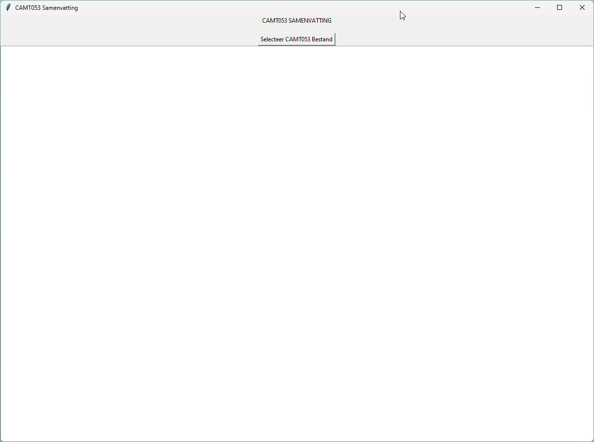
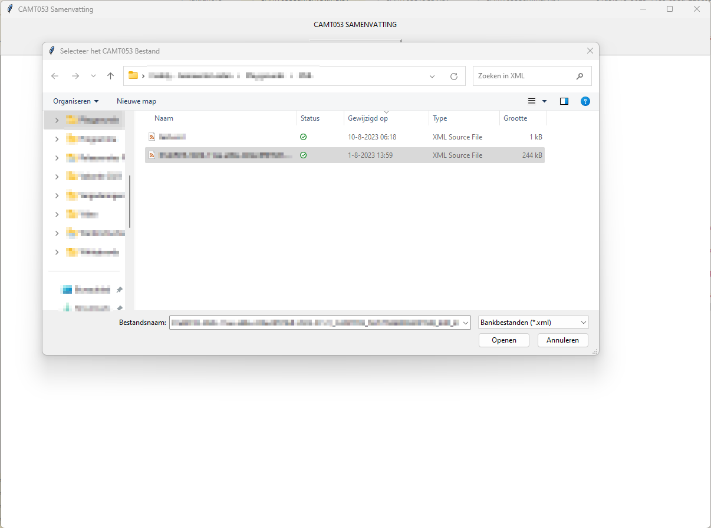
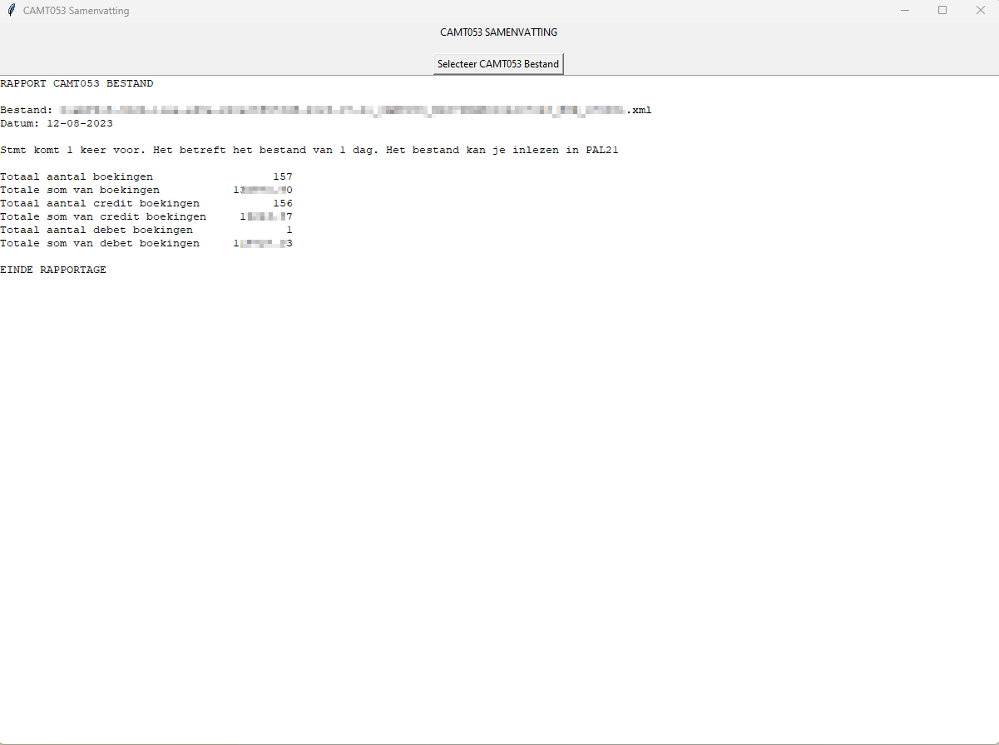

# CAMT.053 Tools
Welcome to the CAMT.053 tools repo. I am Freddy Meijer and at the time business engineer at Leiden. In a Betty Blocks application we retrieve information from the bank in a CAMT.053 XML file. In this repo you find serveral tools to work with those files.
## Installation
To install the CAMT.053 Tools al you need to do is:

- Download and install an instance of Python
- Open your terminal navigate to the desired folder and use `git clone https://github.com/FreddyMeijer/CAMT.053-Tools.git`
- Open the folder in which the git was cloned
- Run `pip install -r requirements.txt`
- Run the desired function by using e.g. `python3 CAMT.053Summary.py`
## .gitignore
The gitignore file states that .csv and .xml files will not be uploaded through git. The information in the files is personal en thereby protected under GDPA regulations. So the files itself should never be uploaded on GitHub.

## CAMT.053Summary
There are serveral bugs reported in Leiden in which a CAMT.053 file had serveral entries of another day. This may not occur. So with this tool, the CAMT.053 file is evaluated. The element *Stmt* must be unique. So, there should only be once in the file. The user selects a file and the code checks how many times *Stmt* is in the file. When you start this file, a screen appears in which you can choose the CAMT.053 file

Now you can select a CAMT.053 file by clicking on the button *Selecteer CAMT.053 bestand*

When you hit *open* the file is parsed and the summary is given in the active window:

## CAMT.053ToCSV
The Python code to tanslate the XML to CSV is devided in three functions:

- parse_CAMT.053_xml
Through naming the path (like XPath) the code will search the textelements in serveral XML elements. The information is saved in transactions.

- write_to_csv
This is the function which writes a header and the transactions to a file.

- selectfile
This is the function which asks the user to select a CAMT.053 file. The location on which the CAMT.053 is retrieved, the CSV will be saved.